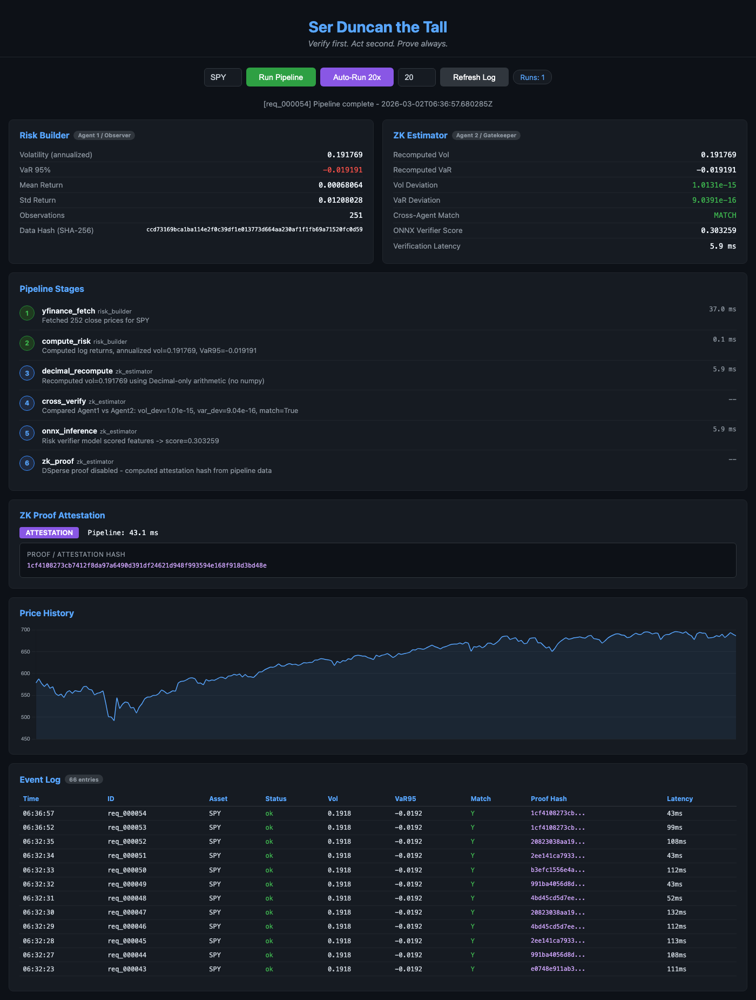
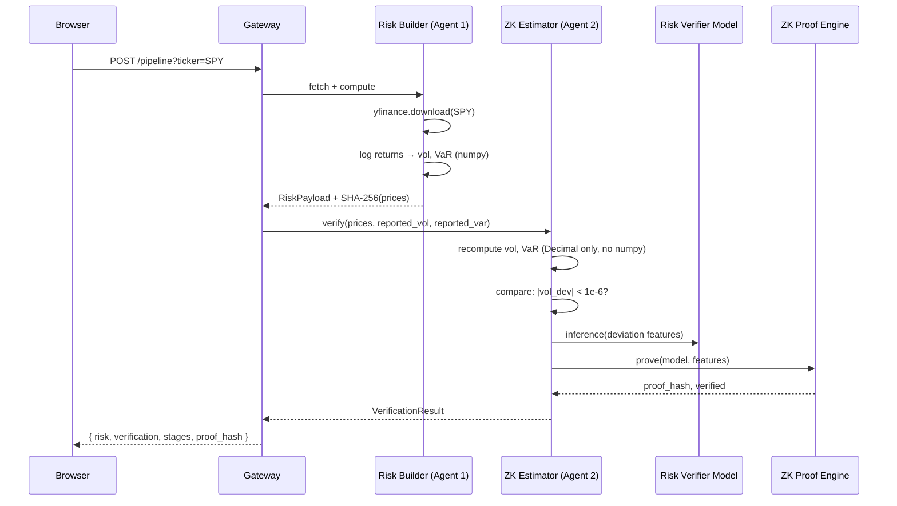
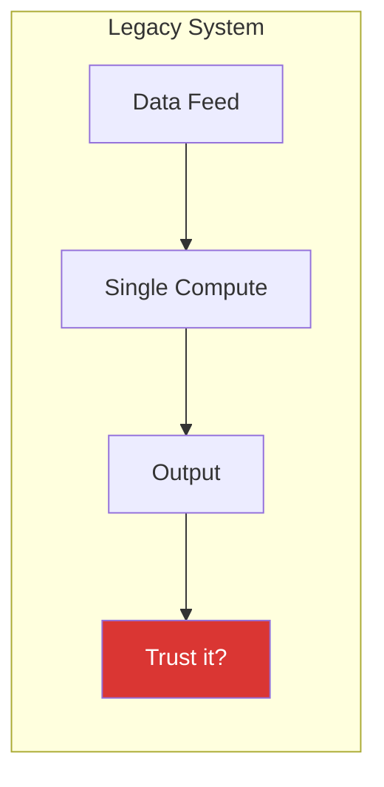
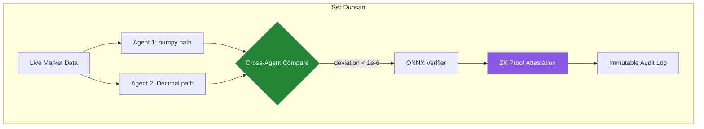
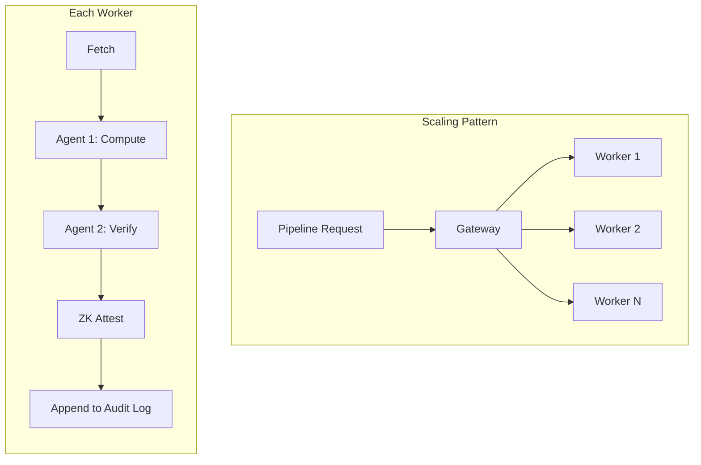
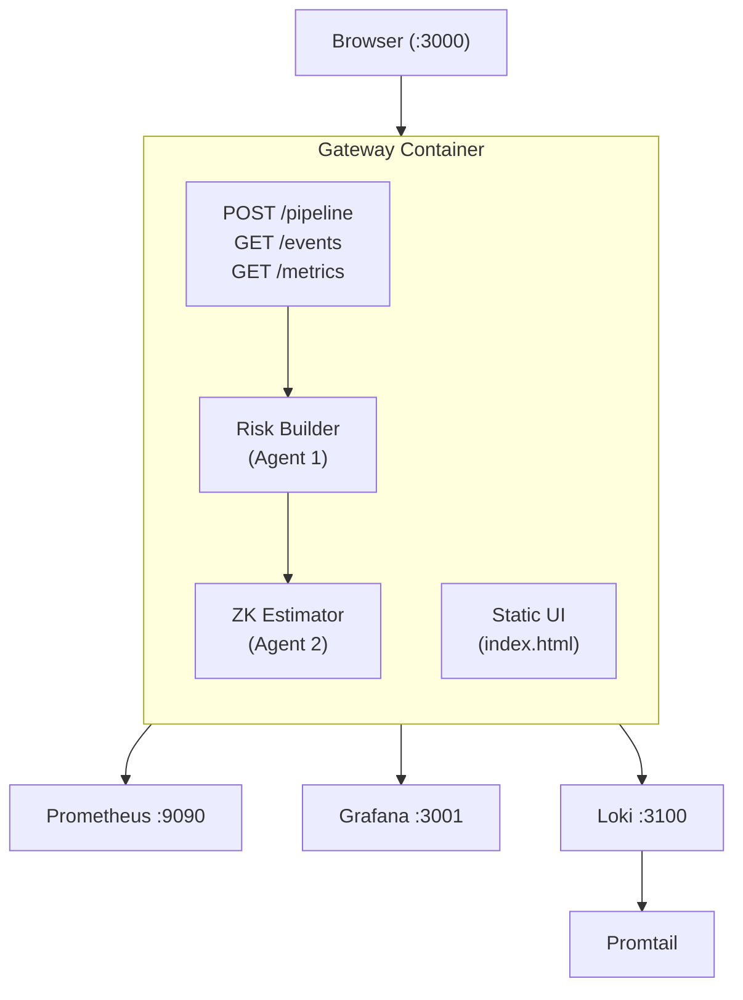

# Ser Duncan the Tall

> *Verify first. Act second. Prove always.*

A multi-agent system where two independent agents compute financial risk metrics from live market data, then cryptographically prove the computation was performed correctly using zero-knowledge proofs. Built on the [OpenClaw](https://github.com/inference-labs-inc/dsperse) framework.



---

## What It Does

Traditional financial systems compute risk metrics (volatility, Value-at-Risk) and trust the output blindly. Ser Duncan takes a different approach: **every computation is independently verified by a second agent using a completely different code path, and the result is cryptographically attested**.

Two agents work in sequence on every request:



**Agent 1 (Risk Builder)** fetches live SPY ETF prices via yfinance and computes annualized volatility and 95% parametric VaR using numpy.

**Agent 2 (ZK Estimator)** receives the same price array and recomputes the identical metrics using Python's `decimal.Decimal` module — a completely independent code path with no shared computation. It then compares the results, runs an ONNX verifier model, and generates a cryptographic attestation hash.

---

## How It Solves Scale and Legacy Problems

### The Legacy Problem



Legacy risk systems are **single-path**: one codebase fetches data, computes metrics, and outputs results. There's no independent verification. If the computation drifts, has a bug, or uses stale data, nobody knows until it's too late. Auditors review code after the fact — never the actual execution.

### The Ser Duncan Approach



Every computation produces a **proof chain**: data hash, independent recomputation, deviation measurement, model inference score, and cryptographic attestation. This proof chain is immutable and externally verifiable.

### Scale



The architecture scales horizontally because:

| Legacy Problem | Ser Duncan Solution |
|---|---|
| Verification requires re-running the entire pipeline manually | Agent 2 verifies in-band on every request (~6ms overhead) |
| Audits happen after the fact, reviewing code not execution | Every execution produces a cryptographic attestation hash |
| Float drift between systems causes silent disagreements | Decimal-string serialization between agents; 1e-6 relative tolerance gate |
| Adding verification means adding infrastructure | Both agents are FastAPI routers in one container — zero additional infra |
| Proof of correct execution doesn't exist | ZK proof pipeline (witness → prove → verify) via DSperse/jstprove |
| Monitoring is bolted on | Prometheus metrics, Grafana dashboards, and Loki log ingestion ship in the same docker-compose |

---

## Architecture



## Pipeline Stages

Each `/pipeline` request executes 6 stages with per-stage timing:

| # | Agent | Action | What Happens |
|---|---|---|---|
| 1 | Risk Builder | `yfinance_fetch` | Downloads close prices, converts to Decimal strings, SHA-256 hashes the array |
| 2 | Risk Builder | `compute_risk` | Log returns → annualized volatility (`std * sqrt(252)`) + 95% parametric VaR |
| 3 | ZK Estimator | `decimal_recompute` | Recomputes vol/VaR using `decimal.Decimal` — different code, same math |
| 4 | ZK Estimator | `cross_verify` | Compares Agent 1 vs Agent 2 with 1e-6 relative tolerance |
| 5 | ZK Estimator | `onnx_inference` | Feeds deviation features into a 4→8→1 neural net (Gemm→Relu→Gemm) |
| 6 | ZK Estimator | `zk_proof` | Generates cryptographic attestation hash (full ZK proof when DSperse is enabled) |

## Quick Start

```bash
# On EC2 (Ubuntu 22.04)
git clone https://github.com/shirin-shahabi/Ser_Duncan_the_tall.git
cd Ser_Duncan_the_tall
cp .env.example .env
docker compose up -d --build
```

Open `http://<public-ip>:3000` in a browser.

## Endpoints

| Endpoint | Method | Description |
|---|---|---|
| `/pipeline?ticker=SPY&window_days=252` | POST | Full risk computation + verification pipeline |
| `/risk/compute` | POST | Agent 1 only: fetch + compute |
| `/risk/verify` | POST | Agent 2 only: recompute + verify |
| `/events` | GET | Audit log (JSONL entries) |
| `/metrics` | GET | Prometheus metrics |
| `/health` | GET | Health check |

## Stack

FastAPI, yfinance, numpy, onnxruntime, Prometheus, Grafana, Loki, Docker.
ZK proofs via [DSperse](https://github.com/inference-labs-inc/dsperse) / jstprove.
